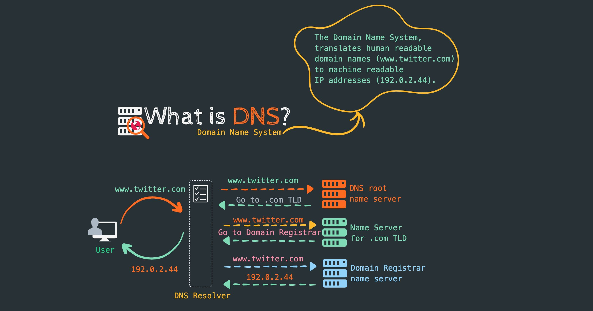
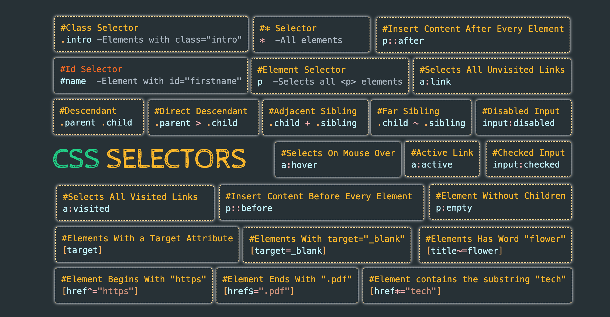
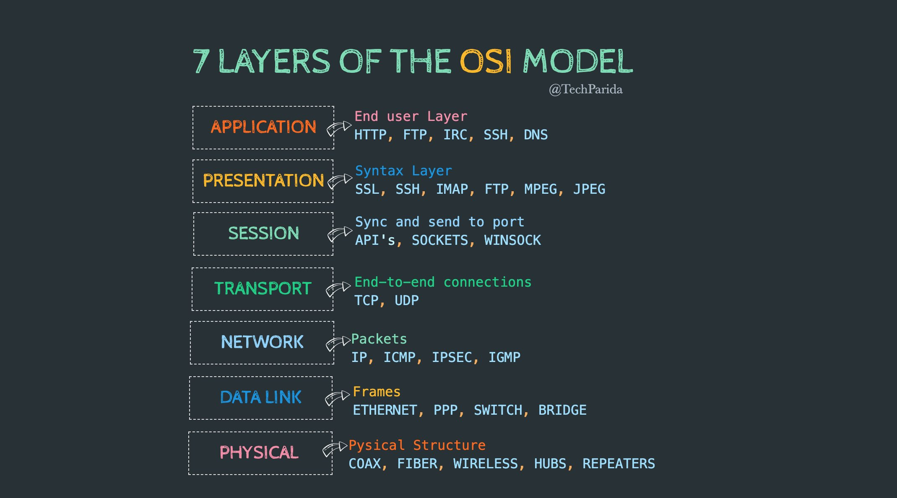
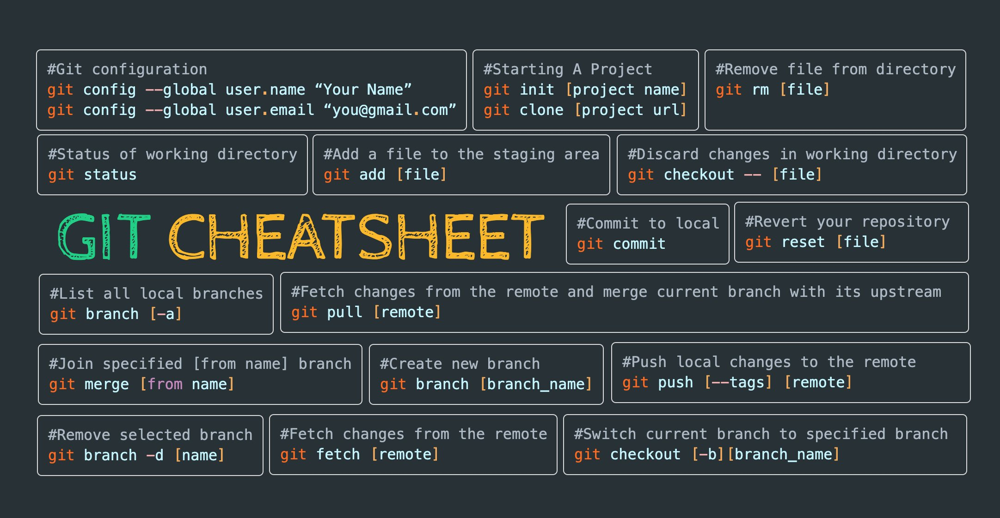
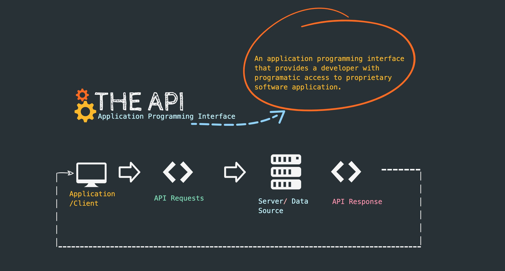
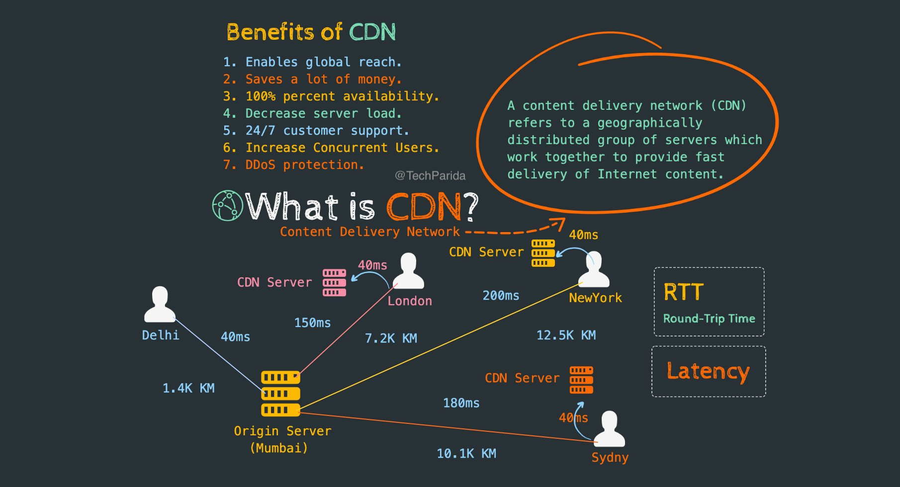
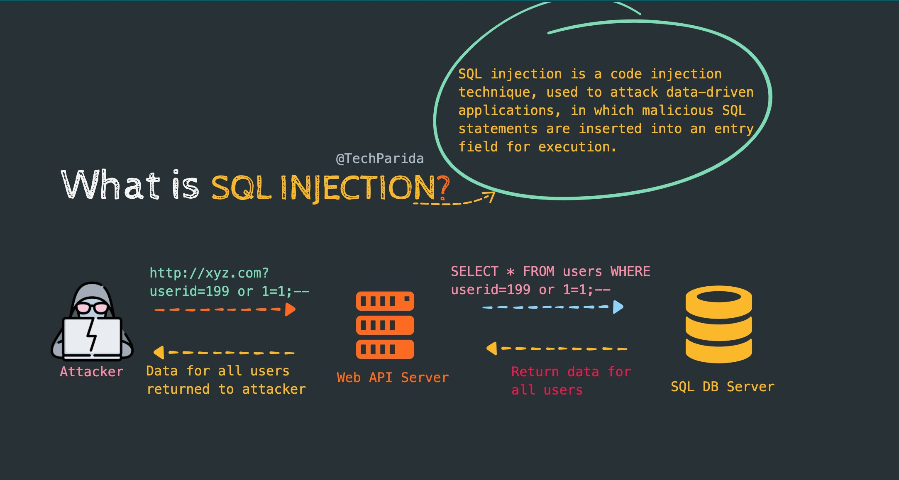
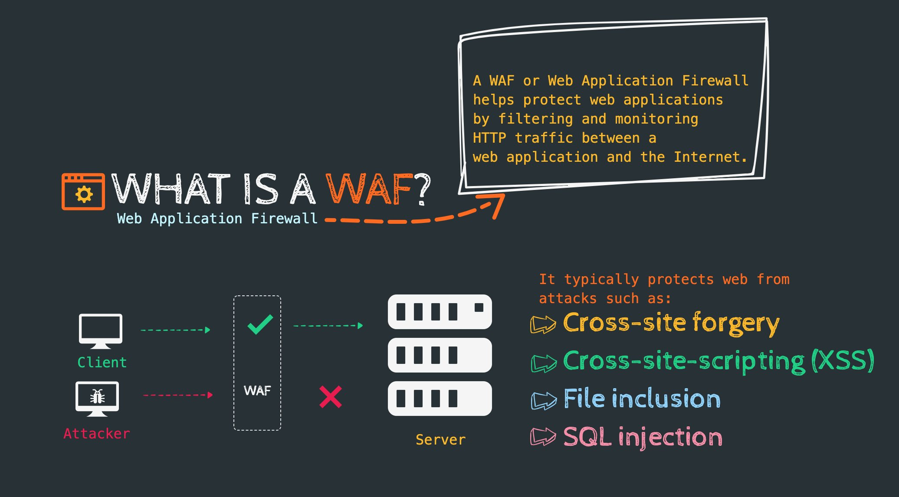

## Internet

1. How does the internet work?
2. What is HTTP?
3. Browsers and how they work?
5. DNS and how it works?
6. What is Domain Name?
7. What is hosting?

## Basic Front-end Knowledge

1. HTML
2. CSS
3. JavaScript

## OS and General Knowledge

1. Terminal usage
2. How OSs work in general
3. Process Mgt.
4. Threads & concurrency
5. Basic terminal commands
6. Memory mgt.
7. Interprocess comm.
8. I/O mgt.
9. POSIX basics
10. Basic networking concepts

## Version Control System

1. Basic usage of Git
2. Repo hosting services
    1. GitHub
    2. Gitlab
    3. Bitbucket

## SQL vs NOSQL

## More About Databases

1. ORMs
2. ACID
3. Transactions
4. N+1 Problem
5. Data Replication
6. Sharding Strategies
7. CAP Theorem
8. Database Normalisation
9. Indexes and how they work

## Learn About APIs

1. REST
2. JSON APIs
3. HATOAS
4. Open API Spec and Swagger
5. Authentication
6. GraphQL

## Caching

1. CDN
2. Server-side
    1. Redis
    2. Memcached
3. Client-side

## Web Security Knowledge

1. Hashing Algorithm 
   1. MD5 and why not to use it
   2. SHA Family
   3. Scrypt
   4. Bcrypt
2. HTTPS
3. Content Security Policy
4. CORS
5. SSL/TLS
6. OWASP Security Risk

## Testing

1. Integration Testing
2. Unit Testing
3. Functional Testing

## CI/CD

1. Jenkins
2. GitLab
3. CircleCI
4. Bamboo
5. TeamCity
6. Travis CI
7. Buddy

## Design and Development Principles

1. SOLID
2. KISS
3. YAGNI
4. DRY
5. GOF Design Patterns
6. Domain-Driven Design
7. Test-Driven Development

## Architectural Patterns

1. Monolithic
2. Microservices
3. SOA
4. CQRS and Event Sourcing
5. Serverless

## Message Brokers

1. RabbitMQ
2. Kafka

## Containerization

1. Docker
2. rkt
3. LXC

## Web Servers

1. Nginx
2. Apache
3. Caddy
4. MS IIS

[codingx](https://www.youtube.com/c/codingx)

